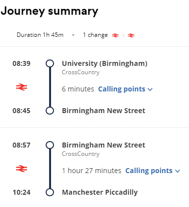
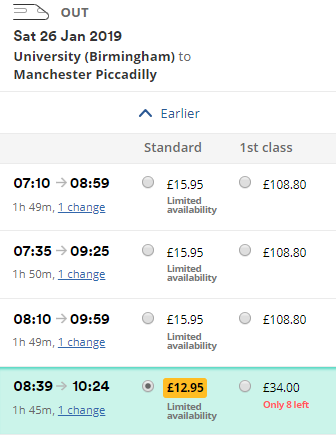
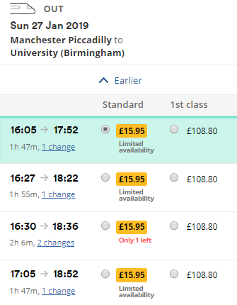
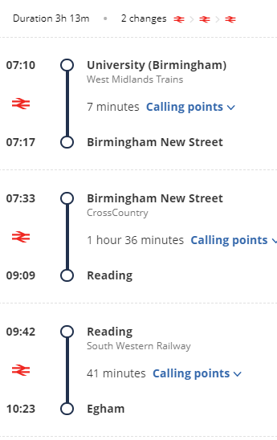
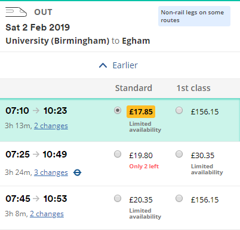
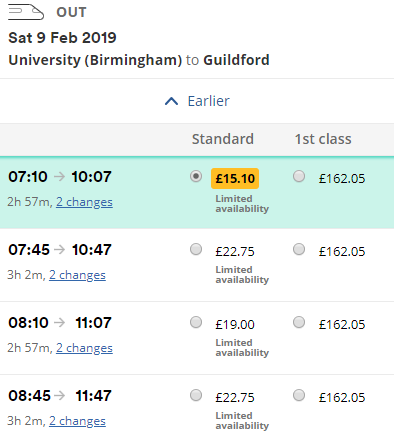
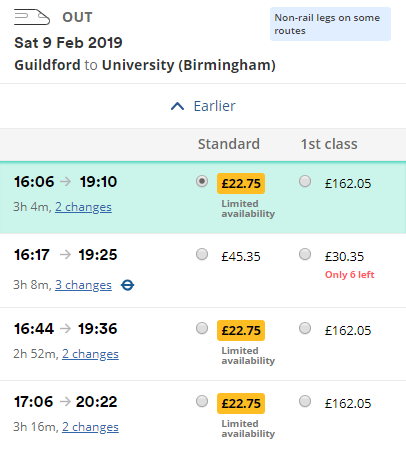

# Hackathon Travel Spring 2019
Cheapest method is to buy individual tickets (return separate). I will find some and post them here.

## ManMetHacks
New Street to Manchester Piccadilly + 15 minute walk
1 change from University

(There is an option to get the train to Manchester Oxford Road [closer to university but more changes] but prices may be more - will follow up)
Just under 2 hours

### Route

### Saturday Morning

### Sunday Evening

---
## Royal Hackaway
New Street to Egham (via Reading) + 20 minute walk
2 changes from University
Just over 3 hours
Change at Reading

### Route

### Saturday Morning

### Sunday Evening

---

## HackSurrey
New Street to Guildford (via Reading)
2 changes from University
Around 3 hours

### Route

### Saturday Morning

### Sunday Evening

---

## R. U. Hacking?
New Street to Reading
- 1 change from University
- Around 2 hours
- 1.8 miles from University (40 minute walk)

### Route

### Saturday Morning

### Sunday Evening